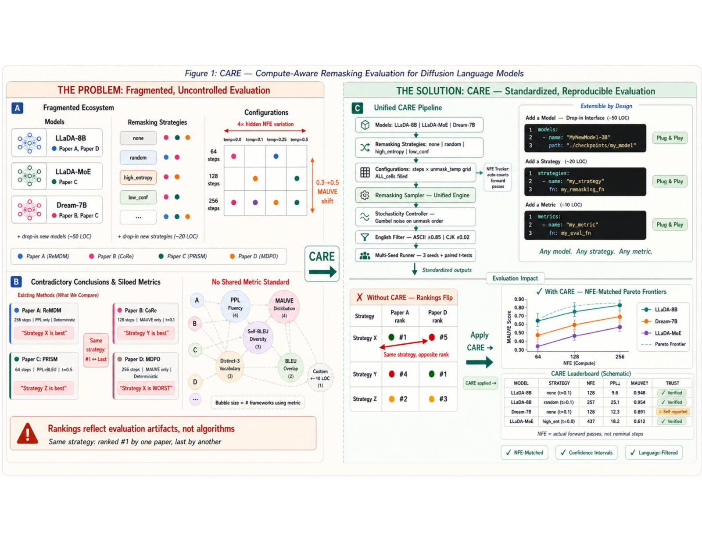

<div align="center">


# CaRE: Compute-Aware Remasking Evaluation

**A compute-aware evaluation framework for masked diffusion language model remasking strategies**

[](https://neurips.cc)
[](https://arxiv.org)
[](https://yash25112003.github.io/CaRE/)
[](LICENSE)
[](https://python.org)

[**🏆 Leaderboard**](https://yash25112003.github.io/CaRE/) · [**📄 Paper**](https://arxiv.org) · [**🤗 Models**](https://huggingface.co) · [**📦 PyPI**](#installation)

</div>

---

## TL;DR

Seven recent remasking papers for masked diffusion LMs produce **contradictory rankings** because they vary compute, metrics, and sampling temperature — each of which independently reverses conclusions. **CaRE** jointly controls all three and reveals a fourth: their *interaction*. At 256 steps and `unmask_temp=0.25`, high-entropy remasking *reduces* MAUVE by **0.296** (*p* = 0.020) — the exact regime where it was reported to help.

<div align="center">

<p><em>Three confounds — compute (NFE), metric, and stochasticity — each independently reverse published strategy rankings. Controlling all three reveals their interaction (p = 0.020).</em></p>
</div>

---

## Overview

Masked diffusion language models (MDLMs) such as [LLaDA-8B](https://github.com/ML-GSAI/LLaDA) and [Dream-7B](https://github.com/hao-ai-lab/Dream) are now competitive with autoregressive LMs, yet their evaluation infrastructure lags behind. **CaRE** (*Compute-Aware Remasking Evaluation*) is a standardized framework that makes MDLM remasking claims reproducible and comparable by jointly controlling:

| Confound | What goes wrong without control |
|---|---|
| **Compute (NFE)** | "256 steps" spans 128–513 actual forward passes — a 4× range |
| **Metric** | PPL and MAUVE rankings reverse across strategies and budgets |
| **Stochasticity** | `unmask_temp: 0.0 → 0.1` shifts MAUVE by 0.3–0.5 — larger than any strategy difference |

**Key findings**

- Temperature dominates MAUVE variance (*η*² = 0.91); strategy × temperature interaction is significant (*p* = 0.002, *η*² = 0.47)
- Compute-matched comparisons reverse several published strategy rankings on both unconditional generation and HumanEval
- The interaction direction holds across **all 12** open-weight MDLMs we evaluate; its magnitude spans ~9× (0.034 to 0.296)

---

## The Seven-Point Protocol

Every omission independently reverses published conclusions.

| # | Practice | What goes wrong without it |
|---|---|---|
| 1 | **Report actual NFE** | "256 steps" hides 128–513 forward passes (4× range) |
| 2 | **Multi-metric reporting** | PPL and MAUVE rankings reverse (Tables 4, 5) |
| 3 | **External-evaluator PPL** | Shared vocabulary inflates scores; use Llama-3-8B |
| 4 | **Control stochasticity** | `t: 0.0→0.1` shifts MAUVE by 0.3–0.5 — larger than any strategy |
| 5 | **Language filtering** | Off-target language contaminates MAUVE unpredictably |
| 6 | **Include `none` baseline** | Improvements may be vs. an artificially weak reference |
| 7 | **Report uncertainty** | Single-seed MAUVE margins < 0.1 are unreliable (SE up to 0.05) |

---

## Leaderboard

**CARE Leaderboard — Tier 1** (256 nominal steps · English-filtered · OWT prefix = 64 tokens · *t* = 0.25)  
Full interactive leaderboard at **[yash25112003.github.io/CaRE](https://yash25112003.github.io/CaRE/)**.

| Model | Scale | MAUVE (`none`) | MAUVE (`h_ent.`) | Gap ↓ | HE pass@1 |
|---|---|:---:|:---:|:---:|:---:|
| LLaDA-8B-Base | 8B | 0.948 | 0.652 | **0.296** | 32.0 |
| LLaDA-8B-Instruct | 8B | 0.928 | 0.641 | 0.287 | 36.5 |
| LLaDA-1.5 | 8B | 0.939 | 0.681 | 0.258 | 38.0 |
| LLaDA-MoE-A1B* | ~1B | 0.954 | 0.793 | 0.161 | 18.5 |
| Dream-7B-Instruct | 7B | 0.927 | 0.861 | 0.066 | 31.0 |
| Dream-7B-Base† | 7B | 0.955 | 0.921 | **0.034** | 27.5 |
| *AR Reference (GPT-2-XL, p=0.95)* | *1.5B* | *0.742* | *—* | *—* | *—* |

> *Gap = MAUVE(`none`) − MAUVE(`h_ent.`) at `unmask_temp=0.25`. Lower gap = less affected by the remasking × stochasticity confound.*  
> `*` MoE results at *t* = 0.1. `†` Dream uses `entropy` strategy in place of `high_entropy`.

**Tier 2** (extended coverage: 0.5B–8B, architecture/scale diversity)

| Model | Scale | MAUVE (`none`) | MAUVE (`h_ent.`) | Gap ↓ | HE pass@1 |
|---|---|:---:|:---:|:---:|:---:|
| SM-Dream-7B | 7B | 0.913 | 0.823 | 0.090 | 29.5 |
| Dream-Coder-7B | 7B | 0.886 | 0.742 | 0.144 | 34.0 |
| DiffuLLaMA-7B | 7B | 0.872 | 0.617 | 0.255 | 21.0 |
| Tiny-A2D (Qwen-0.6B) | 0.6B | 0.691 | 0.476 | 0.215 | 5.8 |
| Tiny-A2D (Qwen-0.5B) | 0.5B | 0.662 | 0.448 | 0.214 | 4.5 |
| BERT-Chat | 150M | 0.418 | 0.283 | 0.135 | 0.8 |

---

## Installation

```bash
pip install care-eval   # coming soon — see harness/ for development install
```

**Development install**

```bash
git clone https://github.com/yash25112003/CaRE.git
cd CaRE
pip install -e ".[dev]"
```

**Requirements:** Python ≥ 3.9 · PyTorch ≥ 2.1 · CUDA-capable GPU (A100 80GB recommended; most experiments runnable on A10/A6000)

---

## Quick Start

**Run the minimal reproducibility check** (LLaDA-8B-Base, `none` vs. `high_entropy`, 3 seeds):

```bash
care-eval run \
  --model llada-8b-base \
  --strategy none high_entropy \
  --steps 64 128 256 \
  --unmask_temp 0.0 0.1 0.25 0.5 \
  --seeds 3 \
  --tasks openwebtext_prefix
```

**Evaluate a new model** (~50 LOC):

```python
from care_eval import RemaskingSampler

class MyModel(RemaskingSampler):
    def load(self):
        # load your model weights
        ...

    def step(self, masked_ids, step_idx, total_steps):
        # return logits for all positions
        return self.model(masked_ids)

# NFE tracking, language filtering, multi-metric evaluation — handled automatically
```

**Implement a new strategy** (~20 LOC):

```python
from care_eval import RemaskingStrategy

class MyStrategy(RemaskingStrategy):
    def select(self, logits, history, step):
        # logits: (B, L, V)  history: list of prior token sequences
        # return: boolean mask (B, L) for positions to remask
        ...
```

---

## Reproduce Paper Results

| Experiment | Script | Paper reference |
|---|---|---|
| NFE accounting (Table 3) | `scripts/nfe_audit.py` | §4.1 |
| Compute-matched quality (Table 4) | `scripts/compute_matched.py` | §4.1 |
| Stochasticity sweep (Table 6) | `scripts/stoch_sweep.py` | §4.3 |
| Interaction finding (Table 7, 8) | `scripts/interaction.py` | §4.4 |
| Full leaderboard (Tables 11, 20) | `scripts/leaderboard.py` | §4.6 |
| HumanEval (Table 10) | `scripts/humaneval.py` | §4.5 |

All results are reproducible from a single JSON config. Example: `configs/llada_8b_base_full.json`.

**Hardware:** ~500 GPU-hours total on NVIDIA A100 80GB. Key interaction finding reproducible in ~12 GPU-hours (single model, 2 strategies, 3 seeds).

---

## Repository Structure

```
CaRE/
├── index.html              # Interactive leaderboard (GitHub Pages)
├── figures/                # Paper figures (PNGs)
│   ├── CARE_Workflow.png   # Fig 1 — workflow overview
│   ├── fig_pareto_llada.png # Fig 2 — LLaDA Pareto frontier
│   └── ...                 # 11 additional figures
├── harness/                # Python evaluation harness (coming soon)
│   ├── care_eval/
│   │   ├── strategies/     # 7 LLaDA strategies + 3 Dream strategies
│   │   ├── models/         # Model wrappers (LLaDA, Dream, + template)
│   │   ├── metrics/        # MAUVE, PPL, Self-BLEU, Distinct-3, NFE
│   │   └── sampler.py      # RemaskingSampler base class
│   └── scripts/            # Reproduction scripts for all paper tables
├── tasks/                  # Task definitions and dataset hashes
├── submissions/            # JSON configs for leaderboard entries
└── paper/                  # LaTeX source (NeurIPS 2026)
```

---

## Submitting to the Leaderboard

Results are accepted if they satisfy the **seven-point protocol**. Partial compliance is welcome — each satisfied practice is tracked as a trust badge.

```jsonc
// submissions/my_model.json
{
  "submission_metadata": {
    "model": "my-diffusion-lm",
    "submitter": "anonymous",
    "paper_url": "https://arxiv.org/abs/XXXX.XXXXX"
  },
  "method_metadata": {
    "strategy": "none",
    "unmask_temp": [0.0, 0.1, 0.25, 0.5],
    "nominal_steps": 256,
    "actual_nfe": 128
  },
  "tasks": {
    "openwebtext": {
      "mauve": 0.948,
      "ppl": 23.4,
      "self_bleu": 0.013,
      "distinct3": 0.802
    }
  }
}
```

Submit via the [submission form](#) or open a pull request to `submissions/`.

---

## Citation

If you use CaRE in your research, please cite:

```bibtex
@inproceedings{shah2026care,
  title     = {{CaRE}: Compute-Aware Remasking Evaluation Protocol
               for Masked Diffusion Language Models},
  author    = {Shah, Yash and Anonymous Authors},
  booktitle = {Advances in Neural Information Processing Systems
               (Evaluations and Datasets Track)},
  year      = {2026},
  url       = {https://arxiv.org/abs/XXXX.XXXXX}
}
```

---

## Related Work

CaRE builds on and is complementary to:

- **[Generative Frontiers](https://arxiv.org)** — PPL–entropy decomposition of generation quality; CaRE is complementary (§3, §4.4)
- **[ReMDM](https://arxiv.org)** — identifies PPL hacking, advocates MAUVE; does not jointly control stochasticity
- **[dLLM](https://arxiv.org)** — flags inference-hyperparameter sensitivity; implementation-centric without a cross-strategy protocol
- **[lm-evaluation-harness](https://github.com/EleutherAI/lm-evaluation-harness)** — CaRE uses lm-eval for HumanEval and GSM8K
- **[Clean-FID](https://github.com/GaParmar/clean-fid)** / **[SacreBLEU](https://github.com/mjpost/sacrebleu)** — direct analogues in image generation and MT

---

## License

MIT © 2026. See [LICENSE](LICENSE) for details.

The datasets used (OpenWebText, LM1B, HumanEval, GSM8K) are subject to their respective licenses.

---

<div align="center">
<sub>NeurIPS 2026 Evaluations & Datasets Track · Anonymous Submission</sub>
</div>
